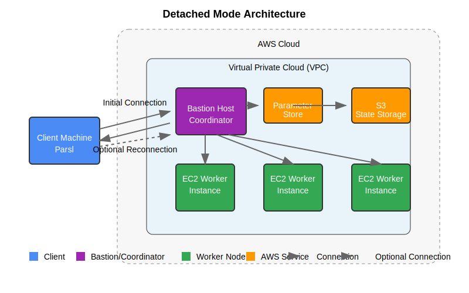

Detached Mode
============

Detached Mode is an advanced operating mode in the Parsl Ephemeral AWS Provider that allows workflows to continue running even if the client disconnects, making it ideal for long-running or critical workflows.



   Architecture diagram of Detached Mode showing persistent bastion host communication

Overview
-------

In Detached Mode, the provider:

1. Creates a persistent bastion/coordinator instance in AWS
2. Runs a dedicated Parsl process on the bastion to manage workers
3. Maintains state in a durable storage service (Parameter Store or S3)
4. Allows the client to disconnect and reconnect as needed
5. Can optionally auto-shutdown when the workflow completes

This mode is best suited for:

* Long-running workflows (hours to days)
* Situations where the client connection might be unstable
* Critical workflows that must continue even if the client disconnects
* Users behind NAT, firewalls, or with dynamic IP addresses

Configuration
-----------

Here's a basic configuration for Detached Mode:

.. code-block:: python

   from parsl.config import Config
   from parsl.executors import HighThroughputExecutor
   from parsl_ephemeral_aws import EphemeralAWSProvider
   
   provider = EphemeralAWSProvider(
       # Specify Detached Mode
       mode='detached',
       
       # Worker configuration
       image_id='ami-12345678',
       instance_type='t3.medium',
       region='us-west-2',
       init_blocks=1,
       min_blocks=0,
       max_blocks=10,
       
       # Bastion configuration
       bastion_instance_type='t3.micro',
       bastion_image_id='ami-12345678',  # Optional: use specific AMI
       bastion_idle_timeout=30,          # Minutes before auto-shutdown when idle
       
       # State persistence (required for detached mode)
       state_store='parameter_store',    # 'parameter_store', 's3', or 'file'
       state_prefix='/parsl/workflows',
       
       # Optional: spot instance settings
       use_spot_instances=True,
       spot_max_price_percentage=80,
   )
   
   config = Config(
       executors=[
           HighThroughputExecutor(
               label='aws_executor',
               provider=provider,
           )
       ]
   )

Key Configuration Options
----------------------

``bastion_instance_type`` (String)
  The AWS instance type for the bastion host. Should be sufficient for coordinating but doesn't need to be powerful. Typically a t3.micro or t3.small is adequate.

``bastion_image_id`` (String, optional)
  A specific AMI to use for the bastion. If not specified, uses the same as worker instances.

``bastion_idle_timeout`` (Integer, optional)
  Time in minutes before the bastion automatically shuts down if no tasks are running. Set to 0 to disable auto-shutdown.

``state_store`` (String, required)
  The storage backend for state persistence. For Detached Mode, you must specify 'parameter_store' or 's3'. Do not use 'file' for Detached Mode as the client and bastion won't share the file system.

``state_prefix`` (String, optional)
  A prefix for state storage paths/keys, useful for organizing multiple workflows.

Operation and Workflow
------------------

During operation, Detached Mode follows this workflow:

1. **Initialization**:
   * Provider creates network resources (VPC, subnet, security group) if not provided
   * Provider launches the bastion/coordinator instance
   * Provider initializes state persistence system
   * Bastion starts a Parsl execution environment

2. **Task Submission**:
   * Client submits initial tasks to the bastion
   * Bastion stores task information in the state store
   * Client can disconnect at this point

3. **Worker Management**:
   * Bastion independently manages worker instances
   * Bastion handles scaling based on workload
   * Bastion monitors task execution and failures

4. **Client Reconnection** (optional):
   * Client can reconnect to check on progress or submit more tasks
   * Reconnection uses state store to synchronize state with the bastion
   * Multiple clients can connect to the same workflow (though not simultaneously)

5. **Workflow Completion**:
   * When all tasks complete, bastion can automatically shut down
   * Worker instances are terminated
   * State persists in the state store for later examination

Connection Sequence
----------------

1. **Initial connection**:
   ```
   Client → Create State → Launch Bastion → Submit Tasks → Disconnect
   ```

2. **Behind the scenes**:
   ```
   Bastion → Manage Workers → Execute Tasks → Update State → Cleanup
   ```

3. **Reconnection** (if needed):
   ```
   Client → Load State → Connect to Bastion → View Progress/Add Tasks
   ```

Advantages and Limitations
-----------------------

Advantages:
  * Workflows continue even if the client disconnects
  * Ideal for long-running, multi-day workflows
  * More reliable for unstable network connections
  * Can survive client machine restarts or crashes
  * State is preserved for troubleshooting

Limitations:
  * Slightly more complex setup than Standard Mode
  * Extra cost for the bastion instance
  * Requires state persistence configuration
  * Minor reconnection delay when checking workflow status

Best Practices
------------

1. **Bastion Sizing**:
   * Use a small, cost-effective instance type for the bastion (t3.micro/t3.small)
   * Ensure it has enough memory for your task coordination needs (typically 1-2GB is adequate)

2. **State Management**:
   * Use Parameter Store for smaller workflows and smaller state sizes
   * Use S3 for larger workflows with more extensive state

3. **Timeout Configuration**:
   * Set appropriate `bastion_idle_timeout` to balance cost savings vs. convenience
   * For critical workflows, set to 0 to disable auto-shutdown

4. **Security**:
   * Set appropriate IAM permissions for the bastion
   * Restrict security group access to minimize attack surface

5. **Monitoring**:
   * Add CloudWatch monitoring to the bastion for operational visibility
   * Set up notifications for workflow completion or failure

Example: Complete Detached Workflow
--------------------------------

Here's a complete example showing a Detached Mode workflow:

.. code-block:: python

   import parsl
   import time
   from parsl.config import Config
   from parsl.executors import HighThroughputExecutor
   from parsl_ephemeral_aws import EphemeralAWSProvider
   
   # Configure AWS Provider in Detached Mode
   provider = EphemeralAWSProvider(
       # Mode and region
       mode='detached',
       region='us-west-2',
       
       # Worker configuration
       image_id='ami-0c55b159cbfafe1f0',  # Amazon Linux 2 (update to current AMI)
       instance_type='t3.medium',
       init_blocks=2,
       min_blocks=0,
       max_blocks=10,
       
       # Bastion configuration
       bastion_instance_type='t3.micro',
       bastion_idle_timeout=60,  # Auto-shutdown after 60 minutes idle
       
       # State persistence
       state_store='parameter_store',
       state_prefix='/parsl/detached-demo',
       
       # Use spot instances for cost savings
       use_spot_instances=True,
       spot_max_price_percentage=70,
       
       # Worker initialization
       worker_init='''
           sudo yum update -y
           sudo yum install -y python3-devel
           python3 -m pip install --upgrade pip
           python3 -m pip install numpy scipy pandas
       ''',
   )
   
   # Create Parsl configuration
   config = Config(
       executors=[
           HighThroughputExecutor(
               label='aws_executor',
               provider=provider,
           )
       ]
   )
   
   # Load the configuration
   parsl.load(config)
   
   # Define a compute-intensive app
   @parsl.python_app
   def long_compute(x):
       import numpy as np
       import time
       import socket
       import datetime
       
       # Simulate long-running work
       time.sleep(300)  # 5 minutes
       result = np.sum([x**i for i in range(1000)])
       
       return {
           'input': x,
           'result': result,
           'hostname': socket.gethostname(),
           'timestamp': datetime.datetime.now().isoformat()
       }
   
   # Submit multiple tasks
   results = []
   for i in range(20):
       results.append(long_compute(i))
   
   print("Tasks submitted and now running on the bastion.")
   print("You can now disconnect. The workflow will continue running.")
   print(f"State is saved with prefix: /parsl/detached-demo")
   print("To reconnect, use the same configuration with the same state_prefix.")
   
   # Optional: Wait for some results before disconnecting
   for r in results[:2]:
       print(f"Task completed on {r.result()['hostname']} at {r.result()['timestamp']}")
   
   # The client can now exit or disconnect
   # The bastion will continue running the tasks and will auto-shutdown
   # when complete (after idle_timeout minutes)

Reconnecting to a Running Workflow
-------------------------------

To reconnect to a running workflow:

.. code-block:: python

   import parsl
   from parsl.config import Config
   from parsl.executors import HighThroughputExecutor
   from parsl_ephemeral_aws import EphemeralAWSProvider
   
   # Use the SAME configuration, especially state_prefix
   provider = EphemeralAWSProvider(
       mode='detached',
       region='us-west-2',
       state_store='parameter_store',
       state_prefix='/parsl/detached-demo',  # MUST match the original
   )
   
   config = Config(
       executors=[
           HighThroughputExecutor(
               label='aws_executor',
               provider=provider,
           )
       ]
   )
   
   # This will reconnect to the existing workflow
   parsl.load(config)
   
   # Now you can check task status
   # If you saved the future objects, you can retrieve them from the DFK
   
   # Hint: To manage futures across sessions, save their IDs
   # future_ids = [f.tid for f in results]
   # And later retrieve them:
   # futures = [parsl.dfk().tasks[tid] for tid in future_ids]

Next Steps
---------

* Learn about :doc:`serverless_mode` for true pay-per-use computing
* Explore :doc:`../user_guide/state_persistence` for more details on state storage options
* See :doc:`../advanced_topics/cost_optimization` for reducing AWS costs
* Check out :doc:`../examples/hybrid_workflows` for combining different modes in a single workflow