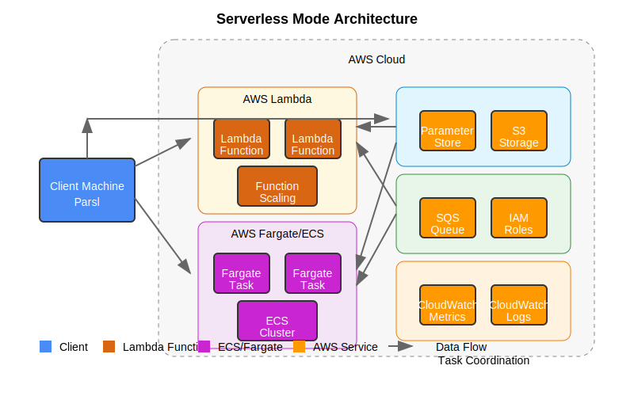

Serverless Mode
=============

Serverless Mode is the most cost-efficient operating mode in the Parsl Ephemeral AWS Provider, leveraging AWS Lambda and ECS/Fargate to provide true pay-per-use computing with zero infrastructure management.

   Architecture diagram of Serverless Mode showing Lambda and ECS/Fargate integration

Overview
-------

In Serverless Mode, the provider:

1. Uses AWS Lambda functions and/or ECS/Fargate tasks to execute Parsl tasks
2. Scales from zero to thousands of concurrent executions in seconds
3. Charges only for the compute time actually used (no idle costs)
4. Automatically handles all infrastructure provisioning and cleanup
5. Supports both short-running (Lambda) and longer-running (ECS) tasks

This mode is best suited for:

* Cost-sensitive workloads with intermittent compute needs
* Highly-variable or bursty workloads
* Short-running tasks (especially for Lambda, which has a 15-minute limit)
* Development and testing environments
* Event-driven workflows

Configuration
-----------

Here's a basic configuration for Serverless Mode:

.. code-block:: python

   from parsl.config import Config
   from parsl.executors import HighThroughputExecutor
   from parsl_ephemeral_aws import EphemeralAWSProvider

   provider = EphemeralAWSProvider(
       # Specify Serverless Mode
       mode='serverless',
       region='us-west-2',

       # Choose worker type: 'lambda', 'ecs', or 'auto'
       worker_type='auto',  # Let the provider decide based on task requirements

       # Lambda configuration
       lambda_memory=1024,          # MB
       lambda_timeout=900,          # Seconds (max 15 minutes)
       lambda_max_concurrency=100,  # Max concurrent functions

       # ECS/Fargate configuration
       ecs_task_cpu=1024,           # CPU units (1024 = 1 vCPU)
       ecs_task_memory=2048,        # MB
       ecs_max_tasks=10,            # Max concurrent tasks

       # Container configuration
       container_image='public.ecr.aws/amazonlinux/amazonlinux:2',  # Default image
       # Alternatively, use a custom image
       # container_image='123456789012.dkr.ecr.us-west-2.amazonaws.com/my-image:latest',

       # State persistence (recommended)
       state_store='parameter_store',
       state_prefix='/parsl/serverless',
   )

   config = Config(
       executors=[
           HighThroughputExecutor(
               label='serverless_executor',
               provider=provider,
           )
       ]
   )

Key Configuration Options
----------------------

``worker_type`` (String)
  Specifies which serverless compute service to use. Options are:
  - 'lambda': Uses AWS Lambda for all tasks
  - 'ecs': Uses ECS/Fargate for all tasks
  - 'auto': Automatically chooses based on task requirements (default)

``lambda_memory`` (Integer)
  Memory allocated to each Lambda function in MB (128 to 10240 MB). Affects both memory and CPU proportionally.

``lambda_timeout`` (Integer)
  Maximum execution time for Lambda functions in seconds (1 to 900 seconds / 15 minutes).

``lambda_max_concurrency`` (Integer)
  Maximum number of concurrent Lambda invocations (1 to 1000, can be increased via AWS quotas).

``ecs_task_cpu`` (Integer)
  CPU units for ECS tasks (256 = 0.25 vCPU, 1024 = 1 vCPU, etc.)

``ecs_task_memory`` (Integer)
  Memory for ECS tasks in MB (minimum varies by CPU setting)

``ecs_max_tasks`` (Integer)
  Maximum number of concurrent ECS tasks to run.

``container_image`` (String)
  Docker image to use for tasks. Can be from ECR, Docker Hub, or other registries.

Operation and Workflow
------------------

During operation, Serverless Mode follows this workflow:

1. **Initialization**:
   * Provider creates necessary AWS resources (IAM roles, Lambda functions, ECS task definitions)
   * Provider sets up networking components for container tasks
   * State persistence is initialized (Parameter Store or S3)

2. **Task Classification**:
   * Tasks are classified based on their estimated runtime and resource needs
   * Short-running tasks (under 15 minutes) with moderate memory needs go to Lambda
   * Longer-running or resource-intensive tasks go to ECS/Fargate
   * If only one worker type is configured, all tasks use that service

3. **Task Execution**:
   * Lambda functions are invoked directly with task data
   * ECS tasks are launched with task data
   * Tasks execute and return results via the state store
   * Scaling is handled automatically by AWS

4. **Resource Cleanup**:
   * Lambda functions terminate automatically after execution
   * ECS tasks are stopped when complete
   * No ongoing costs when no tasks are running

Worker Type Selection
------------------

The provider uses these criteria for automatic worker type selection:

1. **Task Duration**:
   * Tasks expected to run under 15 minutes → Lambda
   * Tasks expected to run longer → ECS/Fargate

2. **Memory Requirements**:
   * Tasks needing up to 10GB RAM → Lambda
   * Tasks needing more memory → ECS/Fargate

3. **CPU Requirements**:
   * Tasks needing up to 6 vCPUs → Lambda
   * Tasks needing more CPU → ECS/Fargate

4. **Specialized Resources**:
   * Tasks needing custom libraries or environments → ECS/Fargate with custom container image

Advantages and Limitations
-----------------------

Advantages:
  * True pay-per-use pricing with no idle costs
  * Zero infrastructure management
  * Instant scaling from zero to thousands of concurrent executions
  * Simplest operational model with minimal maintenance
  * Ideal for variable or intermittent workloads

Limitations:
  * Lambda time limit of 15 minutes per invocation
  * Limited customization of execution environment
  * Cold start delays on first execution
  * Not suitable for specialized hardware needs (GPU, etc.)
  * Network performance might be lower than EC2-based modes

Best Practices
------------

1. **Function Sizing**:
   * Start with moderate Lambda memory settings (1024-2048 MB) and adjust based on performance
   * Remember that Lambda CPU allocation is proportional to memory

2. **Optimizing Container Images**:
   * Use lightweight base images to reduce cold start time
   * Pre-install dependencies in custom images rather than installing at runtime
   * Push frequently used images to a repository close to your AWS region

3. **Task Design**:
   * Design tasks to be idempotent and restartable
   * Avoid stateful operations that depend on previous execution state
   * Break long-running tasks into shorter segments when possible

4. **Cost Optimization**:
   * Use Lambda for highly variable workloads where instances would be idle
   * Consider Spot Instances through SpotFleet in Standard/Detached mode for predictable, long-running workloads
   * Monitor execution times to optimize Lambda memory settings

Hybrid Approach with Spot Fleet
----------------------------

For more compute-intensive tasks that still benefit from serverless management, you can enable Spot Fleet in Serverless Mode:

.. code-block:: python

   provider = EphemeralAWSProvider(
       mode='serverless',
       region='us-west-2',
       worker_type='auto',

       # Enable Spot Fleet for compute-intensive tasks
       use_spot_fleet=True,
       instance_types=["t3.medium", "t3a.medium", "m5.large"],
       spot_max_price_percentage=80,
       min_blocks=0,
       max_blocks=10,

       # Continue using Lambda for quick tasks
       lambda_memory=1024,
       lambda_timeout=900,
   )

This creates a hybrid approach where:
- Short tasks run on Lambda
- Medium tasks run on ECS/Fargate
- Compute-intensive or long-running tasks use Spot Fleet

Example: Complete Serverless Workflow
----------------------------------

Here's a complete example showing a Serverless Mode workflow:

.. code-block:: python

   import parsl
   from parsl.config import Config
   from parsl.executors import HighThroughputExecutor
   from parsl_ephemeral_aws import EphemeralAWSProvider

   # Configure AWS Provider in Serverless Mode
   provider = EphemeralAWSProvider(
       # Mode configuration
       mode='serverless',
       region='us-west-2',
       worker_type='auto',

       # Lambda configuration
       lambda_memory=1024,
       lambda_timeout=900,
       lambda_max_concurrency=50,

       # ECS configuration
       ecs_task_cpu=1024,
       ecs_task_memory=2048,
       ecs_max_tasks=10,

       # State persistence
       state_store='parameter_store',
       state_prefix='/parsl/serverless-demo',

       # Optional: custom dependencies for Lambda
       lambda_python_dependencies=[
           'numpy==1.21.0',
           'pandas==1.3.0'
       ],
   )

   # Create Parsl configuration
   config = Config(
       executors=[
           HighThroughputExecutor(
               label='serverless_executor',
               provider=provider,
           )
       ]
   )

   # Load the configuration
   parsl.load(config)

   # Define some apps
   @parsl.python_app
   def quick_task(x):
       """This task will likely run on Lambda."""
       import numpy as np
       import time

       # Simulate short work
       time.sleep(2)
       result = np.sum([x**i for i in range(1000)])

       return {
           'input': x,
           'result': result,
           'task_type': 'quick'
       }

   @parsl.python_app
   def medium_task(x):
       """This task will likely run on ECS/Fargate."""
       import numpy as np
       import time

       # Simulate medium-length work
       time.sleep(300)  # 5 minutes

       # Generate and process a large array
       data = np.random.rand(10000, 10000)
       result = np.mean(data, axis=0).sum() * x

       return {
           'input': x,
           'result': float(result),
           'task_type': 'medium'
       }

   # Submit a mix of tasks
   quick_results = [quick_task(i) for i in range(50)]
   medium_results = [medium_task(i) for i in range(5)]

   # Wait for and print some quick results
   for i, r in enumerate(quick_results[:5]):
       print(f"Quick task {i} result: {r.result()['result']}")

   # Wait for and print medium results
   for i, r in enumerate(medium_results):
       print(f"Medium task {i} result: {r.result()['result']}")

   # Clean up
   parsl.dfk().cleanup()

Container Customization
--------------------

To use a custom container image with ECS/Fargate:

1. **Create a Dockerfile**:

   .. code-block:: Dockerfile

      FROM amazonlinux:2

      # Install Python and dependencies
      RUN yum update -y && \
          yum install -y python3 python3-devel gcc && \
          yum clean all

      # Install Python packages
      RUN pip3 install --upgrade pip && \
          pip3 install numpy scipy pandas scikit-learn

      # Set working directory
      WORKDIR /app

      # Set the entrypoint
      ENTRYPOINT ["python3"]

2. **Build and push to Amazon ECR**:

   .. code-block:: bash

      # Create ECR repository if needed
      aws ecr create-repository --repository-name parsl-worker

      # Authenticate Docker to ECR
      aws ecr get-login-password | docker login --username AWS --password-stdin \
          123456789012.dkr.ecr.us-west-2.amazonaws.com

      # Build and tag the image
      docker build -t parsl-worker .
      docker tag parsl-worker:latest 123456789012.dkr.ecr.us-west-2.amazonaws.com/parsl-worker:latest

      # Push to ECR
      docker push 123456789012.dkr.ecr.us-west-2.amazonaws.com/parsl-worker:latest

3. **Use the custom image in configuration**:

   .. code-block:: python

      provider = EphemeralAWSProvider(
          mode='serverless',
          region='us-west-2',
          worker_type='ecs',  # Force ECS for custom image
          container_image='123456789012.dkr.ecr.us-west-2.amazonaws.com/parsl-worker:latest',
          ecs_task_cpu=1024,
          ecs_task_memory=2048,
      )

Next Steps
---------

* Learn about optimizing Lambda functions in :doc:`../advanced_topics/cost_optimization`
* Explore containerization strategies in :doc:`../examples/hybrid_workflows`
* See how to implement event-driven workflows in :doc:`../examples/scientific_computing`
* Check out :doc:`../user_guide/state_persistence` for more details on state storage options
